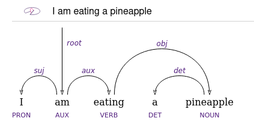

# Reactive Dep Tree

Interactive dependency trees in the browser !

## Description
Reactive-dep-tree is an html component made in Vuejs that allow to easily show interactive dependency trees on any html pages.

## How to implement in 2 steps

### 1 - Source the CDN repo
Add the link to the CDN library in the head of any HTML file

```html
<script src="path/to/CDN/reactive-dep-tree/lib/index.js"></script>
```

### 2 - Create a <reactive-dep-tree> html component
Add the reactive-dep-tree component with the wanted parameters
```html
<reactive-dep-tree
  interactive="true"
  conll="# text = I am eating a pineapple
    1	I	_	PRON	_	_	2	suj	_	_
    2	am	_	AUX	_	_	0	root	_	_
    3	eating	_	VERB	_	_	2	aux	_	_
    4	a	_	DET	_	_	5	det	_	_
    5	pineapple	_	NOUN	_	_	3	obj	_	_
"
></reactive-dep-tree>
```

You should see the corresponding tree appearing on your website



## Parameters

### conll
Source representation of the tree. Must be a proper conll format.

### interactive
If true, allow any user to modify locally on his browser the dependency tree. It can allow users to do quick edit and then export the tree as PNG, SVG or conll format.


